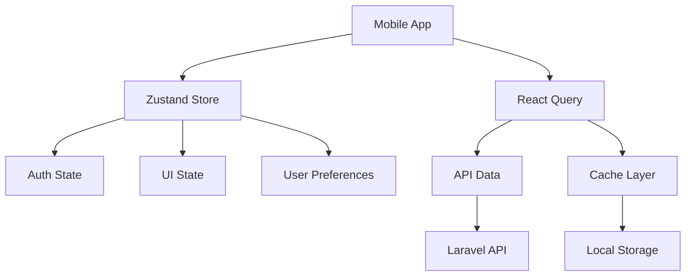
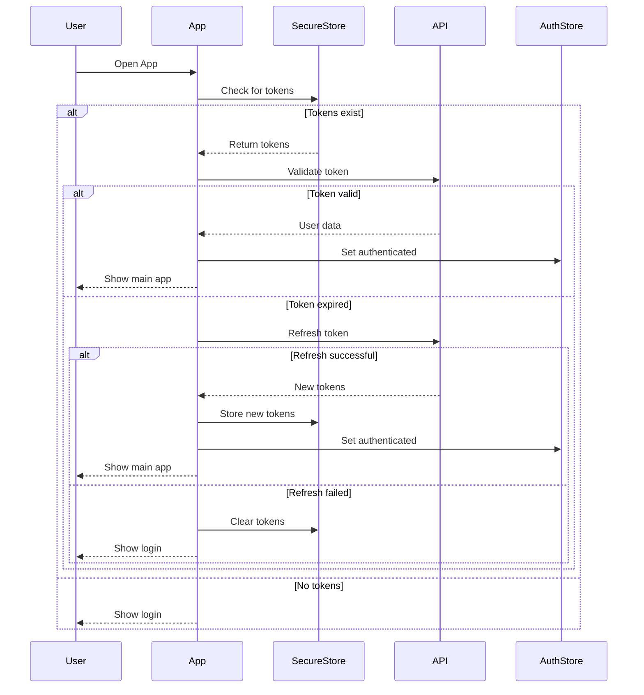
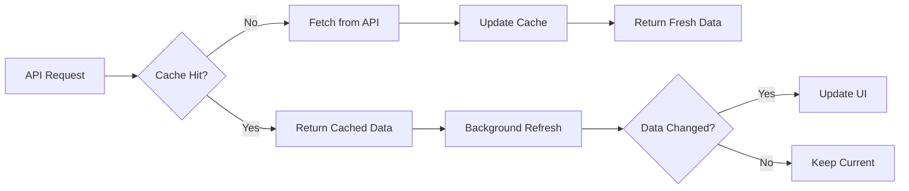
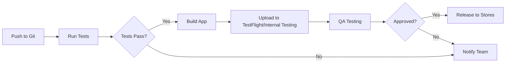
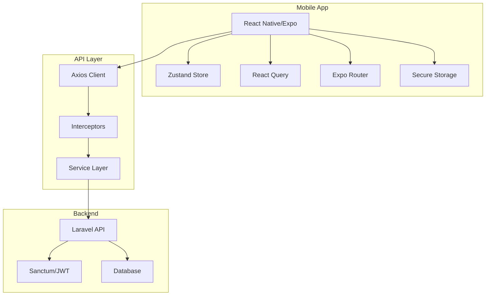
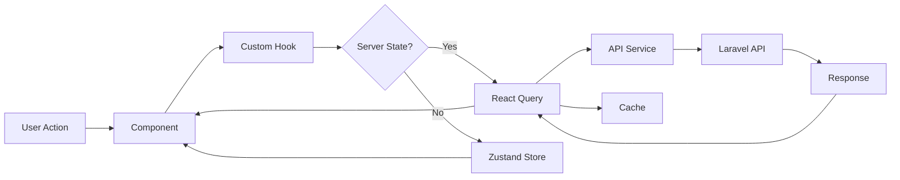

# React Native Mobile App - Production Architecture Plan

A comprehensive plan for building a scalable, production-grade React Native (Expo) mobile application that consumes the existing Laravel API.

---

## Executive Summary

This plan outlines a professional mobile application architecture designed to scale to millions of users across **5 distinct user roles**. The approach emphasizes:

- **Multi-role architecture** supporting Customer, Technician, Car Provider, Tow Truck, and Admin
- **Role-based dashboards** with unique features and permissions per user type
- **Flexible registration flows** from simple (Customer) to complex (Car Provider with business verification)
- **Admin approval system** for service providers (Technician, Car Provider, Tow Truck)
- **Loose coupling** between mobile and backend
- **Security-first** authentication with role-based access control (RBAC)
- **Offline-first** architecture with intelligent caching
- **Type safety** with TypeScript throughout
- **Testability** with comprehensive test coverage
- **Maintainability** through clean architecture patterns

### User Roles

1. **Customer** - Browse/buy cars, parts, services (immediate access)
2. **Technician** - Provide repair services (requires admin approval)
3. **Car Provider** - Sell/rent cars (requires admin approval)
4. **Tow Truck** - Provide towing services (requires admin approval)
5. **Admin** - System administration (limited mobile features)

---

## 1. Scalable Architecture Design

### 1.1 Folder Structure

```
mobile-app/
├── app/                          # Expo Router (file-based routing)
│   ├── (auth)/                   # Auth group
│   │   ├── login.tsx
│   │   ├── register.tsx
│   │   └── forgot-password.tsx
│   ├── (tabs)/                   # Main app tabs
│   │   ├── _layout.tsx
│   │   ├── index.tsx
│   │   ├── marketplace.tsx
│   │   └── profile.tsx
│   ├── _layout.tsx               # Root layout
│   └── +not-found.tsx
│
├── src/
│   ├── api/                      # API Layer
│   │   ├── client.ts             # Axios instance
│   │   ├── interceptors.ts       # Request/response interceptors
│   │   ├── endpoints/            # API endpoints by domain
│   │   │   ├── auth.ts
│   │   │   ├── cars.ts
│   │   │   ├── providers.ts
│   │   │   └── users.ts
│   │   └── types/                # API response types
│   │       ├── auth.types.ts
│   │       ├── car.types.ts
│   │       └── user.types.ts
│   │
│   ├── store/                    # State Management (Zustand)
│   │   ├── index.ts              # Store configuration
│   │   ├── slices/               # Store slices
│   │   │   ├── auth.slice.ts
│   │   │   ├── user.slice.ts
│   │   │   ├── cars.slice.ts
│   │   │   └── ui.slice.ts
│   │   └── middleware/           # Custom middleware
│   │       ├── logger.ts
│   │       └── persist.ts
│   │
│   ├── components/               # Reusable Components
│   │   ├── ui/                   # Base UI components
│   │   │   ├── Button.tsx
│   │   │   ├── Input.tsx
│   │   │   ├── Card.tsx
│   │   │   └── Modal.tsx
│   │   ├── forms/                # Form components
│   │   │   ├── LoginForm.tsx
│   │   │   └── CarListingForm.tsx
│   │   ├── cards/                # Domain-specific cards
│   │   │   ├── CarCard.tsx
│   │   │   └── ProviderCard.tsx
│   │   └── layout/               # Layout components
│   │       ├── Screen.tsx
│   │       └── Header.tsx
│   │
│   ├── screens/                  # Screen components (if not using Expo Router)
│   │   ├── auth/
│   │   ├── marketplace/
│   │   └── profile/
│   │
│   ├── hooks/                    # Custom Hooks
│   │   ├── useAuth.ts
│   │   ├── useApi.ts
│   │   ├── useCache.ts
│   │   ├── useOffline.ts
│   │   └── usePermissions.ts
│   │
│   ├── utils/                    # Utilities
│   │   ├── storage.ts            # Secure storage wrapper
│   │   ├── validation.ts         # Validation helpers
│   │   ├── formatting.ts         # Data formatting
│   │   ├── permissions.ts        # Permission checks
│   │   └── constants.ts          # App constants
│   │
│   ├── services/                 # Business Logic Services
│   │   ├── auth.service.ts
│   │   ├── cache.service.ts
│   │   ├── notification.service.ts
│   │   └── sync.service.ts
│   │
│   ├── types/                    # TypeScript Types
│   │   ├── models/               # Domain models
│   │   │   ├── User.ts
│   │   │   ├── Car.ts
│   │   │   └── Provider.ts
│   │   ├── navigation.ts         # Navigation types
│   │   └── common.ts             # Common types
│   │
│   ├── config/                   # Configuration
│   │   ├── env.ts                # Environment config
│   │   ├── api.config.ts         # API configuration
│   │   └── theme.ts              # Theme configuration
│   │
│   └── constants/                # Constants
│       ├── colors.ts
│       ├── sizes.ts
│       └── routes.ts
│
├── assets/                       # Static Assets
│   ├── images/
│   ├── fonts/
│   └── icons/
│
├── __tests__/                    # Tests
│   ├── unit/
│   ├── integration/
│   └── e2e/
│
├── .env.development
├── .env.staging
├── .env.production
├── app.json
├── babel.config.js
├── tsconfig.json
└── package.json
```

### 1.2 State Management Strategy

**Choice: Zustand + React Query**

#### Why This Combination?

1. **Zustand** for client state:
   - Lightweight (1KB)
   - No boilerplate
   - TypeScript-first
   - Excellent DevTools
   - Easy to test

2. **React Query (TanStack Query)** for server state:
   - Automatic caching
   - Background refetching
   - Optimistic updates
   - Offline support
   - Request deduplication



### 1.3 API Layer Abstraction

**Three-Layer Architecture:**

1. **HTTP Client Layer** - Axios with interceptors
2. **Service Layer** - Business logic and data transformation
3. **Hook Layer** - React Query hooks for components

This ensures:
- Single source of truth for API calls
- Easy to mock for testing
- Centralized error handling
- Request/response transformation
- Token refresh logic

### 1.4 Error Handling Strategy

**Multi-Level Error Handling:**

1. **Network Level** - Axios interceptors
2. **Service Level** - Try-catch with typed errors
3. **Component Level** - Error boundaries
4. **User Level** - Toast notifications and error screens

### 1.5 Security Best Practices

1. **Token Storage**: Use `expo-secure-store` (encrypted storage)
2. **Certificate Pinning**: For production API calls
3. **Code Obfuscation**: Protect sensitive logic
4. **API Key Protection**: Never hardcode, use environment variables
5. **Biometric Authentication**: Face ID/Touch ID for sensitive actions
6. **Jailbreak Detection**: Prevent running on compromised devices
7. **HTTPS Only**: Enforce secure connections
8. **Token Refresh**: Automatic silent refresh before expiry

---

## 2. Authentication Flow Design

### 2.1 Authentication Architecture



### 2.2 Token Management

**Strategy:**
- **Access Token**: Short-lived (15 minutes)
- **Refresh Token**: Long-lived (7 days)
- **Automatic Refresh**: 2 minutes before expiry
- **Secure Storage**: Encrypted device storage

### 2.3 Role-Based Access Control (RBAC)

**Implementation:**
- Store user roles/permissions in auth store
- Create permission hooks for components
- Route guards based on roles
- Conditional UI rendering

---

## 3. Recommended Libraries

### 3.1 Core Dependencies

| Category | Library | Version | Purpose |
|----------|---------|---------|---------|
| **Framework** | `expo` | ~52.0.0 | React Native framework |
| **Navigation** | `expo-router` | ~4.0.0 | File-based routing |
| **State (Client)** | `zustand` | ^4.5.0 | Client state management |
| **State (Server)** | `@tanstack/react-query` | ^5.0.0 | Server state & caching |
| **API Client** | `axios` | ^1.6.0 | HTTP requests |
| **Forms** | `react-hook-form` | ^7.50.0 | Form management |
| **Validation** | `zod` | ^3.22.0 | Schema validation |
| **Storage** | `expo-secure-store` | ~13.0.0 | Encrypted storage |
| **Notifications** | `expo-notifications` | ~0.28.0 | Push notifications |
| **Offline** | `@tanstack/query-persist-client-core` | ^5.0.0 | Offline persistence |
| **UI Library** | `react-native-paper` | ^5.12.0 | Material Design components |
| **Icons** | `@expo/vector-icons` | ^14.0.0 | Icon library |
| **Date/Time** | `date-fns` | ^3.0.0 | Date utilities |
| **Image Picker** | `expo-image-picker` | ~15.0.0 | Image selection |
| **Camera** | `expo-camera` | ~15.0.0 | Camera access |
| **Location** | `expo-location` | ~17.0.0 | GPS/location |
| **Biometrics** | `expo-local-authentication` | ~14.0.0 | Face ID/Touch ID |

### 3.2 Development Dependencies

```json
{
  "devDependencies": {
    "@types/react": "~18.2.45",
    "@types/react-native": "~0.73.0",
    "typescript": "^5.3.0",
    "eslint": "^8.56.0",
    "prettier": "^3.2.0",
    "jest": "^29.7.0",
    "@testing-library/react-native": "^12.4.0"
  }
}
```

### 3.3 Why These Choices?

#### Navigation: Expo Router
- File-based routing (like Next.js)
- Type-safe navigation
- Deep linking built-in
- SEO-friendly URLs

#### Forms: React Hook Form + Zod
- Minimal re-renders
- TypeScript integration
- Schema-based validation
- Small bundle size

#### Caching: React Query
- Industry standard
- Automatic cache invalidation
- Optimistic updates
- Offline support

#### Push Notifications: Expo Notifications
- Cross-platform
- Easy setup
- Background notifications
- Rich notifications support

---

## 4. Reusability & Coupling Strategy

### 4.1 Reusing React Web Logic

**Shared Code Strategy:**

```
shared-logic/              # Separate package or monorepo
├── src/
│   ├── hooks/             # Platform-agnostic hooks
│   │   ├── useCarFilters.ts
│   │   └── useValidation.ts
│   ├── utils/             # Pure functions
│   │   ├── formatting.ts
│   │   └── calculations.ts
│   ├── types/             # Shared types
│   │   └── models.ts
│   └── constants/         # Shared constants
│       └── config.ts
```

**What to Share:**
- ✅ Business logic hooks
- ✅ Data transformation utilities
- ✅ Validation schemas
- ✅ Type definitions
- ✅ Constants and configurations

**What NOT to Share:**
- ❌ UI components (different paradigms)
- ❌ Routing logic
- ❌ Platform-specific APIs

### 4.2 Keeping Mobile & Backend Loosely Coupled

**Strategies:**

1. **API Versioning**
   ```
   /api/v1/cars
   /api/v2/cars
   ```

2. **Contract Testing**
   - Define API contracts
   - Test against contracts
   - Detect breaking changes early

3. **Feature Flags**
   - Enable/disable features remotely
   - Gradual rollouts
   - A/B testing

4. **Backward Compatibility**
   - Support multiple API versions
   - Graceful degradation
   - Optional fields

### 4.3 API Versioning Strategy

**Mobile-Specific Considerations:**

```typescript
// API version in headers
const apiClient = axios.create({
  baseURL: API_BASE_URL,
  headers: {
    'Accept': 'application/json',
    'X-API-Version': '1.0.0',
    'X-Client-Platform': 'mobile',
    'X-Client-Version': APP_VERSION,
  }
});
```

**Version Management:**

1. **Minimum Supported Version**: Backend enforces minimum mobile version
2. **Deprecation Warnings**: API returns deprecation headers
3. **Force Update**: Critical updates force app update
4. **Graceful Degradation**: Fallback for missing features

---

## 5. Implementation Phases

### Phase 1: Foundation (Week 1)
- [x] Architecture design
- [ ] Project initialization
- [ ] Environment setup
- [ ] Folder structure creation
- [ ] Core dependencies installation

### Phase 2: Infrastructure (Week 2)
- [ ] API client setup
- [ ] Authentication service
- [ ] State management configuration
- [ ] Secure storage implementation
- [ ] Error handling utilities

### Phase 3: Authentication (Week 3)
- [ ] Login screen
- [ ] Registration screen
- [ ] Token management
- [ ] Protected routes
- [ ] Role-based access

### Phase 4: Core Features (Weeks 4-6)
- [ ] Main navigation
- [ ] Car marketplace screens
- [ ] User profile
- [ ] Search and filters
- [ ] Car listing details

### Phase 5: Advanced Features (Weeks 7-8)
- [ ] Offline support
- [ ] Push notifications
- [ ] Image upload
- [ ] Location services
- [ ] Biometric authentication

### Phase 6: Polish & Optimization (Week 9)
- [ ] Performance optimization
- [ ] Animation polish
- [ ] Accessibility improvements
- [ ] Error handling refinement

### Phase 7: Testing (Week 10)
- [ ] Unit tests
- [ ] Integration tests
- [ ] E2E tests
- [ ] Device testing

### Phase 8: Deployment (Week 11-12)
- [ ] App Store submission
- [ ] Google Play submission
- [ ] CI/CD pipeline
- [ ] Monitoring setup

---

## 6. Code Examples

### 6.1 API Service with Axios

See [api-client.example.ts](file:///C:/Users/Monster/.gemini/antigravity/brain/00d7d0cd-a3b1-4183-9da4-1d11a97d1e44/examples/api-client.example.ts)

### 6.2 Authentication Store

See [auth.store.example.ts](file:///C:/Users/Monster/.gemini/antigravity/brain/00d7d0cd-a3b1-4183-9da4-1d11a97d1e44/examples/auth.store.example.ts)

### 6.3 Protected Routes

See [protected-route.example.tsx](file:///C:/Users/Monster/.gemini/antigravity/brain/00d7d0cd-a3b1-4183-9da4-1d11a97d1e44/examples/protected-route.example.tsx)

### 6.4 Environment Configuration

See [env.config.example.ts](file:///C:/Users/Monster/.gemini/antigravity/brain/00d7d0cd-a3b1-4183-9da4-1d11a97d1e44/examples/env.config.example.ts)

---

## 7. Scalability Considerations

### 7.1 Performance Optimization

1. **Code Splitting**: Lazy load screens
2. **Image Optimization**: Use optimized formats (WebP)
3. **List Virtualization**: FlatList with `windowSize` optimization
4. **Memoization**: React.memo, useMemo, useCallback
5. **Bundle Size**: Tree shaking and code splitting

### 7.2 Caching Strategy



### 7.3 Offline Support

**Strategy:**
1. Cache all GET requests
2. Queue mutations when offline
3. Sync when connection restored
4. Conflict resolution strategy

### 7.4 Monitoring & Analytics

**Tools:**
- **Sentry**: Error tracking
- **Firebase Analytics**: User behavior
- **Firebase Performance**: Performance monitoring
- **Crashlytics**: Crash reporting

---

## 8. Security Checklist

- [ ] All API calls use HTTPS
- [ ] Tokens stored in encrypted storage
- [ ] Certificate pinning implemented
- [ ] Sensitive data not logged
- [ ] Biometric authentication for sensitive actions
- [ ] Jailbreak/root detection
- [ ] Code obfuscation enabled
- [ ] API keys in environment variables
- [ ] Input validation on all forms
- [ ] XSS prevention measures

---

## 9. Testing Strategy

### 9.1 Unit Tests
- All utilities and helpers
- Store actions and selectors
- Custom hooks
- Validation functions

### 9.2 Integration Tests
- API service layer
- Authentication flow
- Form submissions
- Navigation flows

### 9.3 E2E Tests
- Critical user journeys
- Login/registration
- Car listing creation
- Search and filters

---

## 10. Deployment Strategy

### 10.1 Build Configurations

- **Development**: Local API, debug mode
- **Staging**: Staging API, production-like
- **Production**: Production API, optimized

### 10.2 CI/CD Pipeline



### 10.3 Release Strategy

1. **Internal Testing**: TestFlight/Internal Track
2. **Beta Testing**: Limited user group
3. **Staged Rollout**: 10% → 50% → 100%
4. **Monitoring**: Watch for crashes/errors
5. **Rollback Plan**: Ability to revert if issues

---

## 11. Next Steps

1. **Review this plan** and provide feedback
2. **Initialize the project** with Expo
3. **Set up the folder structure**
4. **Implement core infrastructure**
5. **Build authentication flow**
6. **Develop feature by feature**

---

## Appendix: Architecture Diagrams

### Overall System Architecture



### Data Flow



---

> [!IMPORTANT]
> This architecture is designed for **production scale**. Every decision prioritizes:
> - **Security**: Encrypted storage, token management, certificate pinning
> - **Performance**: Caching, offline support, optimized rendering
> - **Maintainability**: Clean architecture, TypeScript, comprehensive testing
> - **Scalability**: Modular design, state management, efficient data fetching
