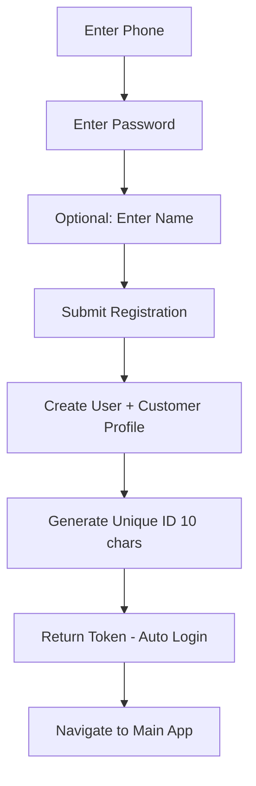
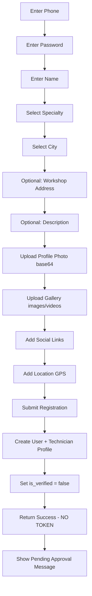
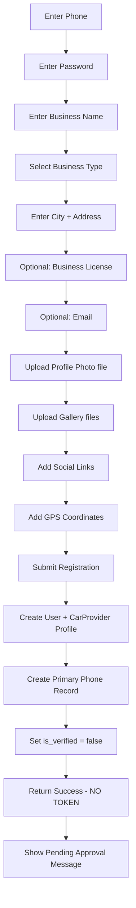
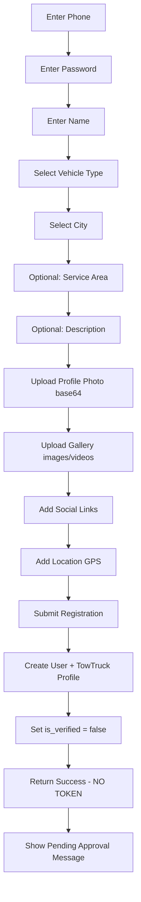

# Multi-Role User System Analysis & Updated Plan

Comprehensive analysis of user roles, registration flows, and dashboard requirements for the Ramouse mobile application.

---

## User Roles Overview

Based on the backend analysis, the system supports **5 distinct user types**:

| Role | Database Table | Requires Verification | Auto-Login After Registration | Primary Use Case |
|------|---------------|----------------------|------------------------------|------------------|
| **Customer** | `customers` | ❌ No | ✅ Yes | Browse and purchase cars, parts, services |
| **Technician** | `technicians` | ✅ Yes (Admin) | ❌ No | Provide car repair services |
| **Car Provider** | `car_providers` | ✅ Yes (Admin) | ❌ No | Sell/rent cars (dealerships, showrooms) |
| **Tow Truck** | `tow_trucks` | ✅ Yes (Admin) | ❌ No | Provide towing services |
| **Admin** | `users` (is_admin=true) | N/A | ✅ Yes | System administration |

---

## Registration Flow Analysis

### 1. Customer Registration

**Flow:**


**API Endpoint:** `POST /auth/register/customer`

**Required Fields:**
- `phone` (required)
- `password` (required, min 6 chars)
- `name` (optional, defaults to "عميل جديد")

**Response:**
```json
{
  "message": "Customer registered successfully",
  "user": { /* Customer profile */ },
  "token": "access_token",
  "role": "customer",
  "user_type": "customer",
  "is_admin": false
}
```

**Unique Features:**
- ✅ Immediate access (no approval needed)
- ✅ Auto-login with token
- Unique ID: 10-character alphanumeric
- Default active status: `is_active = true`

---

### 2. Technician Registration

**Flow:**


**API Endpoint:** `POST /auth/register/technician`

**Required Fields:**
- `phone` (required)
- `password` (required, min 6 chars)
- `name` (required)
- `specialty` (required)
- `city` (required)

**Optional Fields:**
- `workshopAddress`
- `description`
- `profilePhoto` (base64)
- `gallery` (array of {url/data, type})
- `socials` (array)
- `location` ({latitude, longitude})

**Response:**
```json
{
  "message": "Technician registered successfully",
  "user": { /* Technician profile */ },
  "role": "technician",
  "user_type": "technician",
  "is_admin": false,
  "requires_approval": true
}
```

**Unique Features:**
- ❌ NO auto-login (no token returned)
- ⏳ Requires admin verification (`is_verified = false`)
- Unique ID: 6-digit numeric
- Profile photo stored in: `technicians/{phone}/profile/`
- Gallery stored in: `technicians/{phone}/gallery/`
- Default rating: 5.0

**Login Restriction:**
- Cannot login until `is_verified = true` (set by admin)
- Login returns 403 with message: "Account under review"

---

### 3. Car Provider Registration

**Flow:**


**API Endpoint:** `POST /auth/register/car-provider`

**Required Fields:**
- `phone` (required)
- `password` (required, min 6 chars)
- `business_name` (required)
- `business_type` (required)
- `city` (required)
- `address` (required)

**Optional Fields:**
- `business_license`
- `description`
- `email`
- `profile_photo` (file upload, max 10MB)
- `gallery` (array of files, max 10MB each)
- `socials` (array)
- `latitude`, `longitude`

**Response:**
```json
{
  "message": "Provider registered, waiting for approval",
  "user": { /* CarProvider profile */ },
  "role": "car_provider",
  "user_type": "car_provider",
  "is_admin": false,
  "requires_approval": true
}
```

**Unique Features:**
- ❌ NO auto-login (no token returned)
- ⏳ Requires admin verification (`is_verified = false`)
- Unique ID: 10-character alphanumeric
- Uses **FormData** (file uploads, not base64)
- Profile photo stored in: `car_providers/profile_photos/`
- Gallery stored in: `car_providers/gallery/`
- Creates separate `car_provider_phones` record
- Default wallet balance: 0.00

**Login Restriction:**
- Cannot login until `is_verified = true` (set by admin)
- Login returns 403 with message: "Account under review"

---

### 4. Tow Truck Provider Registration

**Flow:**


**API Endpoint:** `POST /auth/register/tow-truck`

**Required Fields:**
- `phone` (required)
- `password` (required, min 6 chars)
- `name` (required)
- `vehicleType` (required)
- `city` (required)

**Optional Fields:**
- `serviceArea`
- `description`
- `profilePhoto` (base64)
- `gallery` (array of {url/data, type})
- `socials` (array)
- `location` ({latitude, longitude})

**Response:**
```json
{
  "message": "Tow truck registered successfully",
  "user": { /* TowTruck profile */ },
  "role": "tow_truck",
  "user_type": "tow_truck",
  "is_admin": false,
  "requires_approval": true
}
```

**Unique Features:**
- ❌ NO auto-login (no token returned)
- ⏳ Requires admin verification (`is_verified = false`)
- Unique ID: 6-digit numeric
- Profile photo stored in: `tow_trucks/{phone}/profile/`
- Gallery stored in: `tow_trucks/{phone}/gallery/`
- Default rating: 5.0

**Login Restriction:**
- Cannot login until `is_verified = true` (set by admin)
- Login returns 403 with message: "Account under review"

---

## Dashboard Requirements by Role

### 1. Customer Dashboard

**Main Sections:**
- 🏠 **Home/Feed**: Browse cars, services, parts
- 🚗 **My Garage**: Saved cars
- ❤️ **Favorites**: Saved listings
- 🛒 **Orders**: Purchase history
- 💰 **Wallet**: Balance, transactions
- 🔔 **Notifications**: Real-time updates
- ⚙️ **Settings**: Profile, preferences

**Key Features:**
- Browse car marketplace (sale/rent)
- Search technicians and tow trucks
- Purchase parts from store
- Participate in auctions
- Manage saved addresses
- View transaction history

**Permissions:**
- ✅ Browse all public content
- ✅ Create car listings (as individual seller)
- ✅ Purchase products
- ✅ Leave reviews
- ✅ Bid on auctions

---

### 2. Technician Dashboard

**Main Sections:**
- 🏠 **Home**: Service requests, nearby customers
- 📊 **Dashboard**: Stats, earnings
- 📝 **My Profile**: Edit profile, gallery, services
- ⭐ **Reviews**: Customer feedback
- 💰 **Wallet**: Earnings, withdrawals
- 📅 **Schedule**: Appointments (if applicable)
- 🔔 **Notifications**: Service requests
- ⚙️ **Settings**: Profile, preferences

**Key Features:**
- Manage profile and gallery
- Update specialty and services
- View and respond to reviews
- Track earnings
- Manage wallet balance
- Update location and availability

**Permissions:**
- ✅ Edit own profile
- ✅ Upload/manage gallery
- ✅ View reviews
- ✅ Manage wallet
- ❌ Cannot create car listings
- ❌ Cannot access admin features

**Status Indicators:**
- 🟢 Verified + Active: Full access
- 🟡 Verified + Inactive: Limited access
- 🔴 Not Verified: Cannot login

---

### 3. Car Provider Dashboard

**Main Sections:**
- 🏠 **Home**: Listings overview
- 📊 **Dashboard**: Sales stats, analytics
- 🚗 **My Listings**: Manage car listings (sale/rent)
- ➕ **Add Listing**: Create new car listing
- ⭐ **Reviews**: Customer feedback
- 💰 **Wallet**: Sales, commissions, withdrawals
- 📞 **Contact Numbers**: Manage multiple phones
- 🏢 **Business Profile**: Edit company info
- 🔔 **Notifications**: Inquiries, sales
- ⚙️ **Settings**: Profile, preferences

**Key Features:**
- Create and manage car listings
- Upload multiple photos per listing
- Set pricing (sale/rent)
- Manage multiple contact numbers
- Track listing analytics
- Manage business profile
- Handle wallet transactions

**Permissions:**
- ✅ Create unlimited car listings (as provider)
- ✅ Edit business profile
- ✅ Manage multiple phone numbers
- ✅ View detailed analytics
- ✅ Manage wallet
- ❌ Cannot access admin features

**Status Indicators:**
- 🟢 Verified + Active: Full access
- 🟡 Verified + Inactive: View only
- 🔴 Not Verified: Cannot login

---

### 4. Tow Truck Provider Dashboard

**Main Sections:**
- 🏠 **Home**: Service requests, nearby customers
- 📊 **Dashboard**: Stats, earnings
- 📝 **My Profile**: Edit profile, gallery, vehicle info
- ⭐ **Reviews**: Customer feedback
- 💰 **Wallet**: Earnings, withdrawals
- 📍 **Location**: Update current location
- 🔔 **Notifications**: Tow requests
- ⚙️ **Settings**: Profile, preferences

**Key Features:**
- Manage profile and vehicle details
- Update service area
- View and respond to reviews
- Track earnings
- Manage wallet balance
- Update real-time location

**Permissions:**
- ✅ Edit own profile
- ✅ Upload/manage gallery
- ✅ View reviews
- ✅ Manage wallet
- ❌ Cannot create car listings
- ❌ Cannot access admin features

**Status Indicators:**
- 🟢 Verified + Active: Full access
- 🟡 Verified + Inactive: Limited access
- 🔴 Not Verified: Cannot login

---

### 5. Admin Dashboard (Mobile - Limited)

**Main Sections:**
- 📊 **Dashboard**: Overview stats
- 👥 **Users**: Pending verifications
- 🚗 **Listings**: Manage all listings
- 🔔 **Notifications**: System alerts

**Key Features:**
- View pending verifications
- Quick approve/reject
- View system stats
- Manage critical issues

**Note:** Full admin features remain on web platform. Mobile admin is for monitoring and quick actions only.

---

## Updated Mobile App Architecture

### Navigation Structure

```
app/
├── (auth)/                          # Authentication Group
│   ├── _layout.tsx
│   ├── login.tsx
│   ├── register.tsx                 # Role selection
│   ├── register-customer.tsx
│   ├── register-technician.tsx
│   ├── register-car-provider.tsx
│   ├── register-tow-truck.tsx
│   └── forgot-password.tsx
│
├── (customer)/                      # Customer Tabs
│   ├── _layout.tsx
│   ├── index.tsx                    # Home/Feed
│   ├── marketplace.tsx
│   ├── garage.tsx
│   ├── favorites.tsx
│   ├── orders.tsx
│   ├── wallet.tsx
│   └── profile.tsx
│
├── (technician)/                    # Technician Tabs
│   ├── _layout.tsx
│   ├── index.tsx                    # Dashboard
│   ├── profile.tsx                  # Edit profile
│   ├── reviews.tsx
│   ├── wallet.tsx
│   └── settings.tsx
│
├── (car-provider)/                  # Car Provider Tabs
│   ├── _layout.tsx
│   ├── index.tsx                    # Dashboard
│   ├── listings.tsx                 # My listings
│   ├── add-listing.tsx
│   ├── profile.tsx                  # Business profile
│   ├── reviews.tsx
│   ├── wallet.tsx
│   └── settings.tsx
│
├── (tow-truck)/                     # Tow Truck Tabs
│   ├── _layout.tsx
│   ├── index.tsx                    # Dashboard
│   ├── profile.tsx                  # Edit profile
│   ├── reviews.tsx
│   ├── wallet.tsx
│   └── settings.tsx
│
├── (admin)/                         # Admin Tabs (Limited)
│   ├── _layout.tsx
│   ├── index.tsx                    # Dashboard
│   ├── verifications.tsx
│   └── listings.tsx
│
├── _layout.tsx                      # Root layout with role-based routing
└── +not-found.tsx
```

### Role-Based Routing Logic

**File:** `app/_layout.tsx`

```typescript
export default function RootLayout() {
  const { user, isAuthenticated } = useAuth();
  const router = useRouter();
  const segments = useSegments();

  useEffect(() => {
    if (!isAuthenticated) {
      router.replace('/(auth)/login');
      return;
    }

    // Route based on user role
    const role = user?.role;
    const inCorrectGroup = segments[0] === `(${role})`;

    if (!inCorrectGroup) {
      switch (role) {
        case 'customer':
          router.replace('/(customer)');
          break;
        case 'technician':
          router.replace('/(technician)');
          break;
        case 'car_provider':
          router.replace('/(car-provider)');
          break;
        case 'tow_truck':
          router.replace('/(tow-truck)');
          break;
        case 'admin':
          router.replace('/(admin)');
          break;
        default:
          router.replace('/(auth)/login');
      }
    }
  }, [isAuthenticated, user, segments]);

  return <Slot />;
}
```

---

## Updated State Management

### Auth Store Enhancement

```typescript
interface User {
  id: number;
  name: string;
  email?: string;
  phone: string;
  role: 'customer' | 'technician' | 'car_provider' | 'tow_truck' | 'admin';
  is_admin: boolean;
  
  // Role-specific profile data
  unique_id?: string;
  is_verified?: boolean;
  is_active?: boolean;
  is_trusted?: boolean;
  
  // Common fields
  profile_photo?: string;
  gallery?: any[];
  socials?: any[];
  wallet_balance?: number;
  average_rating?: number;
  
  // Customer specific
  garage?: any[];
  
  // Technician/Tow Truck specific
  specialty?: string;
  vehicle_type?: string;
  city?: string;
  location?: { latitude: number; longitude: number };
  
  // Car Provider specific
  business_name?: string;
  business_type?: string;
  business_license?: string;
  address?: string;
}
```

---

## Updated Implementation Phases

### Phase 1: Foundation ✅ (Completed)
- [x] Architecture design
- [x] Folder structure
- [x] State management strategy
- [x] Security best practices

### Phase 2: Project Setup (Week 1)
- [ ] Initialize Expo project
- [ ] Set up folder structure with role-based routing
- [ ] Install dependencies
- [ ] Configure environment variables
- [ ] Set up TypeScript paths

### Phase 3: Core Infrastructure (Week 2)
- [ ] Implement API client with interceptors
- [ ] Create enhanced auth store (multi-role support)
- [ ] Set up role-based navigation
- [ ] Implement secure token storage
- [ ] Create error handling utilities

### Phase 4: Authentication (Week 3)
- [ ] **Login screen** (universal for all roles)
- [ ] **Role selection screen**
- [ ] **Customer registration** (simple, immediate access)
- [ ] **Technician registration** (with gallery, pending approval)
- [ ] **Car Provider registration** (with business info, pending approval)
- [ ] **Tow Truck registration** (with vehicle info, pending approval)
- [ ] **OTP verification** (password reset)
- [ ] **Pending approval screen** (for technician/provider/tow truck)

### Phase 5: Customer Features (Week 4-5)
- [ ] Customer dashboard
- [ ] Car marketplace (browse, search, filter)
- [ ] Car listing details
- [ ] Favorites management
- [ ] Garage management
- [ ] Orders history
- [ ] Wallet integration

### Phase 6: Technician Features (Week 6)
- [ ] Technician dashboard
- [ ] Profile management (with gallery upload)
- [ ] Reviews display
- [ ] Wallet management
- [ ] Location updates

### Phase 7: Car Provider Features (Week 7)
- [ ] Car Provider dashboard
- [ ] Listings management
- [ ] Add/Edit car listing wizard
- [ ] Multiple photo upload
- [ ] Phone numbers management
- [ ] Business profile editor
- [ ] Analytics dashboard

### Phase 8: Tow Truck Features (Week 8)
- [ ] Tow Truck dashboard
- [ ] Profile management
- [ ] Vehicle details editor
- [ ] Service area management
- [ ] Real-time location tracking

### Phase 9: Shared Features (Week 9)
- [ ] Wallet system (all roles)
- [ ] Notifications (push + in-app)
- [ ] Reviews system
- [ ] Settings screens
- [ ] Profile photo upload
- [ ] Gallery management

### Phase 10: Advanced Features (Week 10)
- [ ] Offline support
- [ ] Image optimization
- [ ] Location services
- [ ] Biometric authentication
- [ ] Deep linking

### Phase 11: Testing & Polish (Week 11)
- [ ] Unit tests
- [ ] Integration tests
- [ ] E2E tests
- [ ] Performance optimization
- [ ] Accessibility improvements

### Phase 12: Deployment (Week 12)
- [ ] App Store submission
- [ ] Google Play submission
- [ ] CI/CD pipeline
- [ ] Monitoring setup

---

## Key Differences from Original Plan

### 1. **Multi-Role Architecture**
- **Before:** Single user type assumed
- **After:** 5 distinct user types with different dashboards

### 2. **Registration Complexity**
- **Before:** Simple registration
- **After:** 4 different registration flows with varying complexity

### 3. **Approval System**
- **Before:** Immediate access for all
- **After:** Admin approval required for technician, car provider, tow truck

### 4. **Navigation Structure**
- **Before:** Single tab layout
- **After:** Role-based tab layouts with different screens per role

### 5. **File Upload Strategy**
- **Before:** Not specified
- **After:** 
  - Base64 for technician/tow truck
  - FormData for car provider
  - Different storage paths per role

---

## Security Considerations

### 1. **Role-Based Access Control (RBAC)**
```typescript
// Middleware to check role permissions
export const requireRole = (allowedRoles: string[]) => {
  const { user } = useAuth();
  
  if (!user || !allowedRoles.includes(user.role)) {
    throw new Error('Unauthorized');
  }
};

// Usage in screens
requireRole(['car_provider']); // Only car providers can access
```

### 2. **Verification Status Checks**
```typescript
// Check if user can perform action
export const canPerformAction = (user: User, action: string) => {
  // Customers always can (no verification needed)
  if (user.role === 'customer') return true;
  
  // Others need verification
  if (['technician', 'car_provider', 'tow_truck'].includes(user.role)) {
    return user.is_verified && user.is_active;
  }
  
  return false;
};
```

### 3. **Token Refresh Strategy**
- Same for all roles
- Automatic refresh 2 minutes before expiry
- Queue requests during refresh

---

## Next Steps

1. **Review this analysis** and confirm the multi-role approach
2. **Prioritize roles** for implementation (suggest: Customer → Car Provider → Technician → Tow Truck)
3. **Approve updated architecture** with role-based navigation
4. **Begin Phase 2** - Project setup with role-based structure

---

> [!IMPORTANT]
> **Critical Decision Points:**
> 1. Should we implement all roles simultaneously or phase by phase?
> 2. Do we need offline support for pending approval users?
> 3. Should admin features be included in mobile or web-only?
> 4. Do we need real-time location tracking for technicians/tow trucks?

> [!TIP]
> **Recommended Implementation Order:**
> 1. **Week 1-3:** Core + Auth + Customer (immediate value)
> 2. **Week 4-5:** Car Provider (main revenue driver)
> 3. **Week 6-7:** Technician + Tow Truck (service providers)
> 4. **Week 8-12:** Polish, test, deploy
