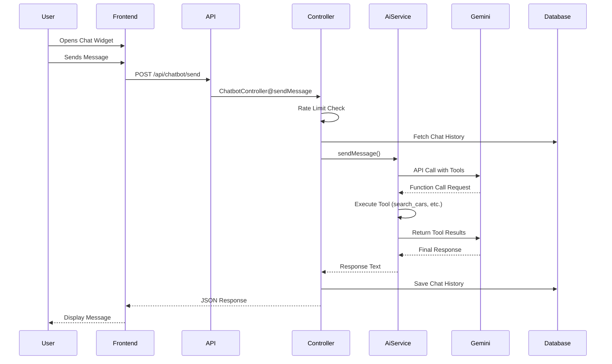

# Ramouse AI Chatbot Documentation

## Overview

The **Ramouse AI Chatbot** (راموسة AI) is an intelligent conversational assistant powered by **Google Gemini 1.5 Flash** that helps users find automotive services on the Ramouse platform. The chatbot offers natural language search capabilities in Arabic (Standard and Syrian dialect) for cars, technicians, tow trucks, and spare parts.

---

## Architecture

### Technology Stack

#### Backend
- **Framework**: Laravel (PHP)
- **AI Model**: Google Gemini 1.5 Flash (`gemini-1.5-flash`) via `google-gemini-php/laravel` package
- **Database**: MySQL (chat_histories table)
- **Caching**: Laravel Cache for rate limiting

#### Frontend
- **Framework**: React + TypeScript
- **UI Library**: Tailwind CSS
- **Animations**: Framer Motion
- **Markdown Rendering**: react-markdown with remark-gfm
- **HTTP Client**: Axios (via custom API wrapper)

### System Flow



---

## Features

### 1. **Intelligent Search with Function Calling**
The chatbot uses Gemini's function calling capability to search the platform's database:

#### Available Tools:
- **`search_cars`** - Search for cars (sale/rent)
  - Parameters: `query`, `type` (sale/rent), `min_price`, `max_price`
  
- **`search_technicians`** - Find mechanics and technicians
  - Parameters: `specialty`, `city`, `near_me` (boolean)
  
- **`search_tow_trucks`** - Find tow truck services
  - Parameters: `city`, `near_me` (boolean)
  
- **`search_products`** - Search spare parts
  - Parameters: `query`

### 2. **Geolocation Support**
The chatbot can use user location (latitude/longitude) to find nearby services using the **Haversine formula** for distance calculation (within 50km radius).

### 3. **Rate Limiting**
- **Guests**: 50 messages/day (IP-based)
- **Authenticated Users**: 100 messages/day (User ID-based)
- Limits stored in Laravel Cache with 24-hour expiry

### 4. **Session Management**
- **Session ID**: UUID generated for each conversation
- **Context Retention**: Last 6 messages kept for context
- **Local Storage**: Frontend stores session ID for continuity

### 5. **Multilingual (Arabic)**
- Supports Modern Standard Arabic (MSA) and Syrian dialect
- RTL (Right-to-Left) UI support
- Voice input with Arabic speech recognition

### 6. **Premium UI/UX**
- Modern glassmorphism design
- Smooth animations with Framer Motion
- Dark mode support
- Markdown rendering for rich responses
- Voice input capability
- Quick action buttons

---

## Backend Implementation

### File Structure
```
Backend/
├── app/
│   ├── Http/Controllers/
│   │   └── ChatbotController.php
│   ├── Services/
│   │   └── AiSearchService.php
│   └── Models/
│       └── ChatHistory.php
├── config/
│   └── gemini.php
└── database/migrations/
    └── 2026_01_31_050453_create_chat_histories_table.php
```

### 1. ChatbotController

**Path**: [`Backend/app/Http/Controllers/ChatbotController.php`](file:///c:/laragon/www/ramouse/Backend/app/Http/Controllers/ChatbotController.php)

#### Key Responsibilities:
- Request validation
- Rate limiting enforcement
- Session management
- Chat history retrieval
- Error handling

#### Main Method: `sendMessage()`

```php
public function sendMessage(Request $request)
{
    // 1. Validate input
    // 2. Check GEMINI_API_KEY
    // 3. Apply rate limits (50/100 per day)
    // 4. Fetch conversation history (last 6 messages)
    // 5. Call AiSearchService
    // 6. Save user + model messages to database
    // 7. Return JSON response
}
```

#### Response Format:
```json
{
  "response": "AI generated response text",
  "session_id": "uuid-string",
  "remaining": 99
}
```

#### Error Responses:
- **429**: Daily limit reached
- **500**: Backend error (Gemini API failure, etc.)

---

### 2. AiSearchService

**Path**: [`Backend/app/Services/AiSearchService.php`](file:///c:/laragon/www/ramouse/Backend/app/Services/AiSearchService.php)

#### System Prompt:
```
You are 'Ramouse AI' (راموسة), an intelligent assistant for Ramouse.com.
You speak Arabic (Standard or Syrian dialect).

RULES:
1. ONLY answer questions related to cars and automotive services
2. Refuse general topics (weather, politics, sports)
3. Use tools to search real data - DO NOT hallucinate
4. Tell users to login if they need to perform actions
5. Be friendly, concise, and helpful
6. Summarize results with key details (Price, Model, Location)
7. ALWAYS use search tools when asked
```

#### Tool Execution Flow:
1. User sends message
2. Gemini analyzes intent
3. If search needed, Gemini calls function (e.g., `search_cars`)
4. Service executes function → queries database
5. Returns results to Gemini
6. Gemini formats natural language response
7. Response sent to user

#### Search Implementation Example:

**`searchCars()`**:
```php
protected function searchCars($args) {
    $query = CarListing::query()
        ->with(['brand', 'carModel', 'city', 'user'])
        ->where('status', 'active')
        ->where('listing_type', $args['type'] ?? 'sale');
    
    // Filter by keywords, price range
    // Limit to 5 results
    // Return structured data
}
```

**Geolocation Search** (Technicians/Tow Trucks):
```php
// Haversine formula for distance calculation
$q->selectRaw("*, ( 6371 * acos( cos( radians(?) ) * cos( radians( latitude ) ) * ... ) ) AS distance", [$userLat, $userLng, $userLat])
  ->having('distance', '<', 50)
  ->orderBy('distance');
```

---

### 3. ChatHistory Model

**Path**: [`Backend/app/Models/ChatHistory.php`](file:///c:/laragon/www/ramouse/Backend/app/Models/ChatHistory.php)

#### Schema:
```php
Schema::create('chat_histories', function (Blueprint $table) {
    $table->id();
    $table->foreignId('user_id')->nullable()->constrained()->onDelete('cascade');
    $table->string('session_id')->nullable()->index();
    $table->enum('role', ['user', 'model', 'system', 'tool']);
    $table->longText('content')->nullable();
    $table->json('tool_calls')->nullable();
    $table->json('tool_results')->nullable();
    $table->timestamps();
});
```

#### Purpose:
- Store conversation history
- Support context retention (last 6 messages)
- Enable analytics and debugging
- Track tool usage

---

### 4. Configuration

**Path**: [`Backend/config/gemini.php`](file:///c:/laragon/www/ramouse/Backend/config/gemini.php)

```php
return [
    'api_key' => env('GEMINI_API_KEY'),
];
```

**.env Configuration**:
```env
GEMINI_API_KEY=your_api_key_here
```

> Get your API key from [Google AI Studio](https://aistudio.google.com/)

---

## Frontend Implementation

### File Structure
```
Frontend/src/
├── components/
│   ├── FloatingChatBotButton.tsx    # Floating button
│   └── Chatbot/
│       ├── ChatWidget.tsx           # Main container
│       ├── ChatWelcome.tsx          # Welcome screen
│       ├── ChatMessage.tsx          # Message bubble
│       └── ChatInput.tsx            # Input with voice
└── services/
    └── ChatService.ts               # API client
```

---

### 1. FloatingChatBotButton

**Path**: [`Frontend/src/components/FloatingChatBotButton.tsx`](file:///c:/laragon/www/ramouse/Frontend/src/components/FloatingChatBotButton.tsx)

#### Features:
- Fixed bottom-right position
- Animated ping effect
- Notification dot
- Smooth open/close transition
- Responsive sizing

#### Usage:
```tsx
<FloatingChatBotButton 
  onClick={() => setIsOpen(!isOpen)} 
  isOpen={isOpen} 
/>
```

---

### 2. ChatWidget

**Path**: [`Frontend/src/components/Chatbot/ChatWidget.tsx`](file:///c:/laragon/www/ramouse/Frontend/src/components/Chatbot/ChatWidget.tsx)

#### Main Container Component
- Manages message state
- Handles API communication
- Auto-scrolls to latest message
- Shows loading indicators
- Clears conversation on user request

#### Key Methods:

**`handleSend()`**:
```typescript
const handleSend = async (text: string) => {
  // Add user message to state
  // Call ChatService.sendMessage()
  // Handle response or errors
  // Show error with rate limit info
};
```

**`handleClear()`**:
```typescript
const handleClear = () => {
  setMessages([]);
  ChatService.clearSession();
};
```

---

### 3. ChatWelcome

**Path**: [`Frontend/src/components/Chatbot/ChatWelcome.tsx`](file:///c:/laragon/www/ramouse/Frontend/src/components/Chatbot/ChatWelcome.tsx)

#### Quick Action Buttons:
- 🚗 Buy a car → "أريد شراء سيارة"
- 🚗 Rent a car → "أريد استئجار سيارة"
- 🔧 Find mechanic → "أبحث عن ميكانيكي قريب"
- 🚚 Tow truck → "أحتاج سطحة طوارئ"
- 🛒 Spare parts → "أبحث عن قطع غيار"

---

### 4. ChatMessage

**Path**: [`Frontend/src/components/Chatbot/ChatMessage.tsx`](file:///c:/laragon/www/ramouse/Frontend/src/components/Chatbot/ChatMessage.tsx)

#### Features:
- User vs AI avatar differentiation
- Markdown rendering with GitHub Flavored Markdown
- Timestamp display
- Responsive bubble design
- Dark mode support

---

### 5. ChatInput

**Path**: [`Frontend/src/components/Chatbot/ChatInput.tsx`](file:///c:/laragon/www/ramouse/Frontend/src/components/Chatbot/ChatInput.tsx)

#### Features:
- Auto-resizing textarea
- Voice input (Web Speech API)
- Arabic RTL support
- Send on Enter (Shift+Enter for newline)
- Loading state

#### Voice Recognition:
```typescript
const SpeechRecognition = window.SpeechRecognition || window.webkitSpeechRecognition;
const recognition = new SpeechRecognition();
recognition.lang = 'ar-SA';
recognition.start();
```

---

### 6. ChatService

**Path**: [`Frontend/src/services/ChatService.ts`](file:///c:/laragon/www/ramouse/Frontend/src/services/ChatService.ts)

#### API Methods:

```typescript
interface ChatService {
  sendMessage(message: string, lat?: number, lng?: number): Promise<ChatResponse>;
  getSessionId(): string | null;
  setSessionId(id: string): void;
  clearSession(): void;
}
```

#### Request Format:
```json
{
  "message": "أريد شراء سيارة BMW",
  "session_id": "uuid",
  "latitude": 33.5138,
  "longitude": 36.2765
}
```

---

## API Endpoints

### POST `/api/chatbot/send`

**Request**:
```json
{
  "message": "string (required, max 1000 chars)",
  "session_id": "string (optional)",
  "latitude": "number (optional)",
  "longitude": "number (optional)"
}
```

**Response (Success)**:
```json
{
  "response": "يمكنني مساعدتك في إيجاد سيارة BMW. هل تريد شراء أو استئجار؟",
  "session_id": "9c8e5f2a-...",
  "remaining": 49
}
```

**Response (Rate Limited)**:
```json
{
  "error": "Daily limit reached.",
  "message": "لقد تجاوزت الحد اليومي كزائر (50). يرجى تسجيل الدخول للمتابعة."
}
```
*Status*: 429

**Response (Error)**:
```json
{
  "error": "Backend Error: ...",
  "message": "عذراً، حدث خطأ تقني: ..."
}
```
*Status*: 500

---

## Database Schema

### Table: `chat_histories`

| Column | Type | Description |
|--------|------|-------------|
| `id` | bigint | Primary key |
| `user_id` | bigint (nullable) | Foreign key to users table |
| `session_id` | string (indexed) | Chat session identifier |
| `role` | enum | 'user', 'model', 'system', 'tool' |
| `content` | longtext | Message content |
| `tool_calls` | json (nullable) | Function calls made by Gemini |
| `tool_results` | json (nullable) | Results returned from tools |
| `created_at` | timestamp | Message timestamp |
| `updated_at` | timestamp | Last update |

**Indexes**:
- Primary: `id`
- Foreign: `user_id` (cascade on delete)
- Index: `session_id`

---

## Configuration & Setup

### Backend Setup

1. **Install Gemini Package**:
```bash
composer require google-gemini-php/laravel
```

2. **Publish Configuration**:
```bash
php artisan vendor:publish --provider="Gemini\Laravel\ServiceProvider"
```

3. **Set API Key** in `.env`:
```env
GEMINI_API_KEY=your_key_here
```

4. **Run Migration**:
```bash
php artisan migrate
```

5. **Add Route** in `routes/api.php`:
```php
Route::post('/chatbot/send', [ChatbotController::class, 'sendMessage']);
```

---

### Frontend Setup

1. **Install Dependencies**:
```bash
npm install framer-motion react-markdown remark-gfm
```

2. **Add to Main Layout**:
```tsx
import { FloatingChatBotButton } from './components/FloatingChatBotButton';
import { ChatWidget } from './components/Chatbot/ChatWidget';

function App() {
  const [isChatOpen, setIsChatOpen] = useState(false);

  return (
    <>
      <FloatingChatBotButton 
        onClick={() => setIsChatOpen(!isChatOpen)} 
        isOpen={isChatOpen} 
      />
      <ChatWidget 
        isOpen={isChatOpen} 
        onClose={() => setIsChatOpen(false)}
        isAuthenticated={!!user}
        onLoginClick={() => navigate('/login')}
      />
    </>
  );
}
```

---

## Rate Limiting Strategy

### Implementation:
- **Cache Key**: `chat_limit_{user_id|ip_address}`
- **Storage**: Laravel Cache (daily expiry)
- **Enforcement**: Pre-execution check in controller

### Limits:
| User Type | Daily Limit | Identification |
|-----------|-------------|----------------|
| Guest | 50 messages | IP Address |
| Authenticated | 100 messages | User ID |

### User Experience:
- Remaining count shown in response
- Clear error messages in Arabic
- Suggestion to login for higher limits

---

## Security Considerations

### 1. **API Key Protection**
- Stored in `.env` (never committed)
- Server-side only (not exposed to frontend)
- Validated before service instantiation

### 2. **Input Validation**
- Max message length: 1000 characters
- Session ID format validation
- Coordinate range validation

### 3. **Rate Limiting**
- Prevents abuse
- IP-based for guests
- User-based for logged-in users

### 4. **Error Handling**
- Generic error messages to users
- Detailed logs for developers
- No sensitive data in responses

### 5. **Database Security**
- Cascading deletes on user removal
- Indexed session IDs for performance
- JSON validation for tool_calls/results

---

## Performance Optimizations

### Backend:
1. **Query Optimization**:
   - Eager loading relationships (`with()`)
   - Result limit (5 items per search)
   - Indexed `session_id` column

2. **Caching**:
   - Rate limit counters cached
   - 24-hour expiry

3. **Context Management**:
   - Only last 6 messages loaded
   - Reversed order for chronological context

### Frontend:
1. **Lazy Rendering**:
   - Chat widget only rendered when open
   - AnimatePresence for smooth unmounting

2. **Optimistic UI**:
   - Instant message display
   - Loading states while waiting

3. **Auto-scrolling**:
   - Smooth scroll behavior
   - Triggered on message updates only

---

## Future Enhancements

### Planned Features:
- [ ] **Rich Media Responses** (Images, cards for listings)
- [ ] **Booking Integration** (Book technician/tow truck via chat)
- [ ] **Multi-language Support** (English, French)
- [ ] **Voice Output** (Text-to-Speech responses)
- [ ] **Chat History Sync** (Cross-device via user account)
- [ ] **Advanced Analytics** (Popular queries, conversion tracking)
- [ ] **Sentiment Analysis** (User satisfaction tracking)
- [ ] **Proactive Suggestions** (Based on user behavior)
- [ ] **Mobile App Integration** (React Native version)

### Technical Improvements:
- [ ] Implement conversation branches
- [ ] Add tool call retry logic
- [ ] Support image inputs (Gemini Vision)
- [ ] Implement streaming responses
- [ ] Add A/B testing for prompts
- [ ] Create admin dashboard for chat analytics

---

## Troubleshooting

### Common Issues:

#### 1. **"GEMINI_API_KEY is missing"**
**Solution**: Add key to `.env`:
```env
GEMINI_API_KEY=your_actual_key
```

#### 2. **429 Rate Limit Errors**
**Solution**: 
- Wait 24 hours for reset
- Login for higher limits
- Adjust limits in `ChatbotController.php`:
  ```php
  $maxDaily = $userId ? 200 : 100; // Example: increase limits
  ```

#### 3. **Voice Input Not Working**
**Solution**:
- Check browser compatibility (Chrome/Edge recommended)
- Ensure HTTPS (required for Web Speech API)
- Grant microphone permissions

#### 4. **Chat History Not Persisting**
**Solution**:
- Check if session_id is stored in localStorage
- Verify migration has run: `php artisan migrate:status`
- Check database connection

#### 5. **Tool Calls Not Executing**
**Solution**:
- Check Gemini API logs: `storage/logs/laravel.log`
- Verify function declarations match expected schema
- Test with simpler queries first

---

## Testing

### Manual Testing Checklist:
- [ ] Guest user can send 50 messages
- [ ] Authenticated user can send 100 messages
- [ ] Car search returns results
- [ ] Technician search with location works
- [ ] Tow truck search works
- [ ] Spare parts search works
- [ ] Voice input works (Arabic)
- [ ] Session persists across page reloads
- [ ] Clear conversation works
- [ ] Dark mode renders correctly
- [ ] Mobile responsive design
- [ ] Error messages shown in Arabic

### Test Queries:
```
1. "أريد شراء سيارة BMW في دمشق"
2. "ابحث عن ميكانيكي قريب مني"
3. "أحتاج سطحة الآن"
4. "قطع غيار هونداي"
5. "ما هو الطقس اليوم؟" (Should refuse - off-topic)
```

---

## References

### Documentation:
- [Google Gemini API Documentation](https://ai.google.dev/docs)
- [Laravel Gemini Package](https://github.com/google-gemini-php/laravel)
- [Framer Motion Docs](https://www.framer.com/motion/)
- [React Markdown](https://github.com/remarkjs/react-markdown)

### Related Files:
- [AiSearchService.php](file:///c:/laragon/www/ramouse/Backend/app/Services/AiSearchService.php)
- [ChatbotController.php](file:///c:/laragon/www/ramouse/Backend/app/Http/Controllers/ChatbotController.php)
- [ChatWidget.tsx](file:///c:/laragon/www/ramouse/Frontend/src/components/Chatbot/ChatWidget.tsx)
- [ChatService.ts](file:///c:/laragon/www/ramouse/Frontend/src/services/ChatService.ts)

---

## Changelog

### Version 1.0 (2026-01-31)
- ✅ Initial implementation with Gemini 1.5 Flash
- ✅ Arabic language support
- ✅ Four search tools (Cars, Technicians, Tow Trucks, Products)
- ✅ Rate limiting system
- ✅ Session management
- ✅ Voice input
- ✅ Premium UI with dark mode
- ✅ Chat history persistence

---

**Last Updated**: January 31, 2026  
**Maintained By**: Ramouse Development Team
